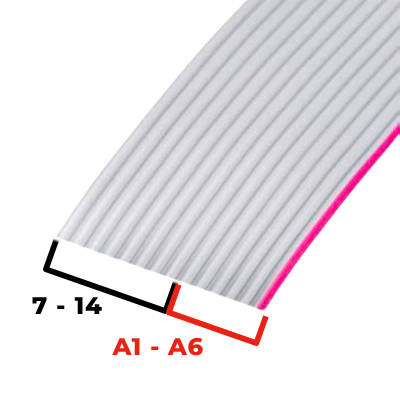

# FarfisaToMIDI

This repository contains code to convert the Farfisa keyboard to a MIDI keyboard using an Arduino board. Now you can finally use it with GarageBand or FL Studio.

Tested with Farfisa SK410 and Arduino MKR WAN 1310

## Requirements

- Arduino IDE
- USB Cable
- MIDIUSB library
- Keypad library
- GarageBand or FL Studio (optional)

## Installation

1. Install Arduino IDE from [here](https://www.arduino.cc/en/software).
2. Clone this repository or download the source code.
3. Install the MIDIUSB and Keypad libraries in Arduino IDE. (You can install libraries through `Sketch > Include Library > Manage Libraries`)

## Usage

1. Connect your Arduino board to your computer.
2. Open the `FarfisaToMIDI.ino` file in Arduino IDE.
3. Select the appropriate board and port from the `Tools` menu.
4. Click the "Upload" button to upload the code to your Arduino board.
5. Once uploaded, open the serial monitor (Tools > Serial Monitor) to view the output.
6. Press keys on your Farfisa keyboard to trigger MIDI messages.

### Using with GarageBand or FL Studio (Optional)

1. Connect your Arduino board to your computer.
2. Open GarageBand or FL Studio on your computer.
3. Ensure that your MIDI keyboard input is set to the Arduino board.
4. Press keys on your Farfisa keyboard to trigger MIDI messages in GarageBand or FL Studio.

## Code Explanation

The code utilizes the MIDIUSB library to send MIDI messages from the Arduino board. It also utilizes the Keypad library to detect key presses from the Farfisa keyboard. Here's a brief overview of the main functions:

- `noteOn`: Sends a MIDI note-on message.
- `noteOff`: Sends a MIDI note-off message.
- `setup`: Initializes the serial communication.
- `loop`: Continuously checks for key presses and sends corresponding MIDI messages.

## Table of Notes

Map the following table to your keyboard if necessary

| Note | -1  | 0   | 1   | 2   | 3   | 4   | 5   | 6   | 7   | 8    | 9    |
|:----:|:---:|:---:|:---:|:---:|:---:|:---:|:---:|:---:|:---:|:----:|:----:|
|  C   |  0  | 12  | 24  | 36  | 48  | 60  | 72  | 84  | 96  | 108  | 120  |
|  C#  |  1  | 13  | 25  | 37  | 49  | 61  | 73  | 85  | 97  | 109  | 121  |
|  D   |  2  | 14  | 26  | 38  | 50  | 62  | 74  | 86  | 98  | 110  | 122  |
|  D#  |  3  | 15  | 27  | 39  | 51  | 63  | 75  | 87  | 99  | 111  | 123  |
|  E   |  4  | 16  | 28  | 40  | 52  | 64  | 76  | 88  | 100 | 112  | 124  |
|  F   |  5  | 17  | 29  | 41  | 53  | 65  | 77  | 89  | 101 | 113  | 125  |
|  F#  |  6  | 18  | 30  | 42  | 54  | 66  | 78  | 90  | 102 | 114  | 126  |
|  G   |  7  | 19  | 31  | 43  | 55  | 67  | 79  | 91  | 103 | 115  | 127  |
|  G#  |  8  | 20  | 32  | 44  | 56  | 68  | 80  | 92  | 104 | 116  |   -   |
|  A   |  9  | 21  | 33  | 45  | 57  | 69  | 81  | 93  | 105 | 117  |   -   |
|  A#  | 10  | 22  | 34  | 46  | 58  | 70  | 82  | 94  | 106 | 118  |   -   |
|  B   | 11  | 23  | 35  | 47  | 59  | 71  | 83  | 95  | 107 | 119  |   -   |

## Wiring - Example for Farfisa 40 keys with Arduino MKR WAN 1310

Connect the Farfisa keyboard to Arduino using the 14-pin flat cable.

- Connect the row pins of the Farfisa keyboard to analog pins A1 to A6.
- Connect the column pins of the Farfisa keyboard to digital pins 7 to 14.

Ensure that the wiring matches the `rowPins` and `colPins` arrays in the code.

## Contributors

- [Giovanni Mirulla](https://github.com/giovannimirulla)

## License

This project is licensed under the MIT License - see the [LICENSE](LICENSE) file for details.
